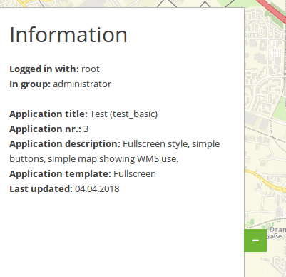

.. _html:

HTML Element
************

This element allows you to add generic HTML anywhere in your application.
In the generic HTML the following variables are available: "application" (Entity Application), "entity" (Entity HTMLElement) and "configuration".

.. image:: ../../../figures/html_result_application.png
     :scale: 80

Configuration
=============

.. image:: ../../../figures/html.png
     :scale: 80

* **Title:** Title of the element. The title will be listed in "Layouts". It will be indicated if "Show label" is activated.
* **Content:** Content of the HTML-element. The variables: "application", "entity" und "configuration" are available in the content. 
* **Classes:** html-element-inline, my-special-css-class
Configuration examples
======================

Integrate logo with embed link
-------------------------------

An HTML element can be used to integrate various additional elements. For example, an image or logo can be integrated. But also a simple text element, or a text or picture element, which is embed with a link to a website. The HTML element can be integrated in different places in the application.

In the application, the HTML element is inserted under the tab Layouts by the ``+`` symbol either in the toolbar, in the sidepane or in the footer.

.. image:: ../../../figures/de/html_add_element.png
     :scale: 80

The dialog "Add element - HTML" appears. For this configuration example, the dialog looks like this:

.. image:: ../../../figures/de/html_example_dialog.png
     :scale: 80

The HTML element that is included here has the title "Mapbender logo". In the content, the desired element is specified as HTML code and in Classes the default setting html-element-inline has been adopted. The code for the application example is:

.. code-block:: html

    

The Mapbender logo is included as image (img src='https://mapbender.org/sites/default/files/mapbender-logo_webside.png'). In addition, the height (height='60px') and the styling are defined for the image. The styling (style=) includes the background color and transparency (background-color:rgb(255, 255, 255, 0.9)) as well as the distance of the picture to the side edge (padding:10px). In addition, a link has been added to the mapbender website (href='http://mapbender.org'), which opens in a new tab when you click on the image (target='_blank').

The element can be integrated in different positions. For example in the toolbar:

.. image:: ../../../figures/de/html_example_toolbar.png
     :scale: 80

In the sidepane:

.. image:: ../../../figures/de/html_example_sidepane.png
     :scale: 80
     
In the footer:

.. image:: ../../../figures/de/html_example_footer.png
     :scale: 80
     

**Add an image**

.. code-block:: html

   

**Add an Link**

.. code-block:: html

  <a href='http://mapbender.org' target='_blank'>Go to the Mapbender Website</a>

Use dynamic variables
----------------------

In the Mapbender there is the possibility to use variables in applications.

**Variable "application.title"** 

Die Anwendung, für die dieses Element konfiguriert wird, sieht im Anwendungsmanager des 
Mapbender wie folgt aus:

.. image:: ../../../figures/de/html_example_application.title_application.png
     :scale: 80

Zuerst muss ein HTML-Element, wie vorher beschrieben über das ``+`` -Zeichen, hinzugefügt werden. Um den Titel der Anwendung einzubinden, wird die Variable "application.title" benötigt.

.. image:: ../../../figures/de/html_example_application.title_dialog.png
     :scale: 80

In diesem Beispiel ist die Bezeichnung (Title) des HTML-Elements "Titel". Im Content wurde folgender Code verwendet:

.. code-block:: html

     <b>
         
            Anwendung {{  application.title }} 
        
     </b>

Der Titel der Anwendung wurde mit dem Textzusatz "Anwendung" eingebunden. Dieser Zusatz ist unabhängig vom Titel der Anwendung und wird vor diesen gesetzt (D.h.: Anwendung + Titel der Anwendung). Durch den Style-Block (style=) wurden die Schriftgröße (font-size:25px), die Schriftfarbe (color:#b6dd18) und die Position (margin-right:50vw) des Titels angepasst. Außerdem wird der Titel fett (<b></b>) angezeigt. Die Variable für den Anwendungstitel wird durch diesen Ausdruck eingebunden: *{{ application.title }}*

Für das Anwendungsbeispiel sieht das Ergebnis des HTML-Elements wie folgt aus:

.. image:: ../../../figures/de/html_example_application.title.png
     :scale: 80

**Variable "entity"**

Die Variable "entity" bindet Parameter des HTML-Elements ein. Wurde beispielsweise die Variable *{{ entity }}* eingebunden, wird die ID des HTML-Elements angezeigt. Wurde die Variable *{{ entity.title }}* eingebunden, wird in der Anwendung die Bezeichnung (Title) des Elements ausgegeben.

Die Konfiguration für das HTML-Element "Titel" und die Variable *{{ entity.title }}* mit dem Textzusatz "HTML-Element" sieht zum Beispiel wie folgt aus:

.. image:: ../../../figures/de/html_example_entity.title_dialog.png
     :scale: 80

Die Parameter für das Styling entsprechen der Konfiguration für das vorherige Beispiel des HTML-Elements mit der Variable application.title. Für entity.title wurden lediglich Textzusatz, Variable und Position (margin-right) angepasst.

Dieses Element sieht in der Anwendung wie folgt aus:

.. image:: ../../../figures/de/html_example_entity.title.png
     :scale: 80

**Allgemeine Informationen**

Mit dem folgenden Konfigurationsbeispiel werden allgemeine Informationen zu der Anwendung und der eingeloggte Benutzer übergeben. Da hier relativ viel Textinhalt visualisiert werden muss, sollte das Element in die Seitenleiste eingebunden werden. 

.. code-block:: html

    <h2>Informationen</h1>
     
    

        <b>Angemeldet als:</b> {{ app.user.username |trans }}  
        <b>In Gruppe:</b><i>???</i> 
    

     
    

        <b>Anwendungstitel:</b> {{ application.title |trans }} ({{ application.slug |trans }})  
        <b>Anwendungs-Nr.:</b> {{ application.id |trans }}  
        <b>Anwendungsbeschreibung:</b> {{ application.description |trans }}  
        <b>Anwendungsvorlage:</b>??? 
        <b>Zuletzt geupdated:</b>??? 
    

YAML-Definition:
----------------

.. code-block:: yaml

    title: 'HTML-Element'
    class: Mapbender\CoreBundle\Element\HTMLElement   
    content: 
Hello, World!

Application: {{ application.title |trans }}
 # the variables: "application", "entity" und "configuration" are available in the content.
    classes: my-special-css-class
   

Class, Widget & Style
=====================

* **Class:** Mapbender\\CoreBundle\\Element\\HTMLElement
* **Widget:** mapbender.mbHTMLElement

HTTP Callbacks
==============

None.

